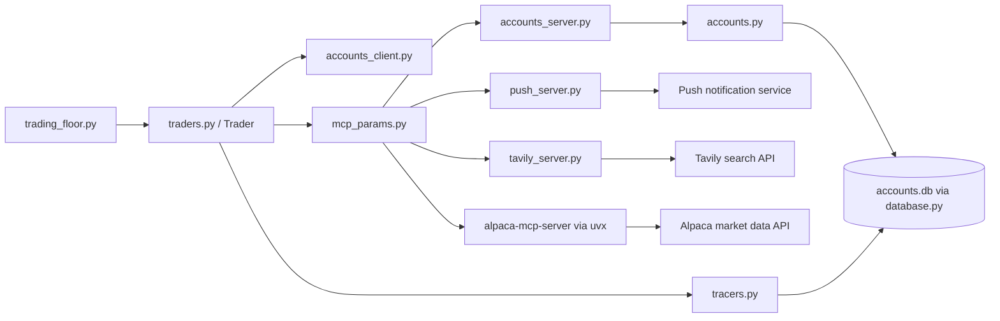

# Backend Overview

This folder contains the trading engine, local data storage, and the MCP servers that the agents use to research, trade, and send notifications.

Scope note: this README intentionally excludes `app.py` and focuses on the rest of the backend Python files.

## High-Level Flow

The backend is organized around a single orchestrator:

1. `trading_floor.py` creates one `Trader` instance per trader name.
2. `traders.py` builds the agent, loads the account state, and runs the agent loop.
3. `mcp_params.py` defines the subprocesses the trader connects to over stdio.
4. The MCP servers expose account, research, market, and push-notification capabilities.
5. `database.py` persists account state, logs, and market snapshots in SQLite.

## Module Map

### `trading_floor.py`

Main scheduler. It:

- loads environment variables
- creates the four traders: Warren, George, Ray, and Cathie
- registers `LogTracer` so trace activity is written into SQLite
- runs each trader in parallel with `asyncio.gather()`
- sleeps for `RUN_EVERY_N_MINUTES` before the next cycle

This file is the entrypoint for the long-running trading loop.

### `traders.py`

Defines the `Trader` class and the runtime path for one trader.

Important responsibilities:

- builds the trading agent and the nested researcher tool
- loads the account JSON through the accounts MCP server
- gets the current strategy and account snapshot
- sends the prompt to the model runner
- opens and closes all MCP subprocess connections with `AsyncExitStack`

Core flow for one trader:

1. create the researcher tool
2. create the trader agent
3. read the account resource from `accounts_client.py`
4. read the strategy resource from `accounts_client.py`
5. build the trade or rebalance prompt from `templates.py`
6. run the agent with `Runner.run(...)`

`Trader.run()` catches exceptions and prints a short error message, which is why deep failures often show up as a generic TaskGroup error unless the underlying exception is inspected directly.

### `mcp_params.py`

Defines the subprocess launch parameters for the MCP servers.

- `trader_mcp_server_params` starts the trader-facing servers:
  - `accounts_server.py`
  - `push_server.py`
  - the Alpaca MCP server via `uvx`
- `researcher_mcp_server_params(name)` starts the research-facing servers:
  - `mcp-server-fetch` via `uvx`
  - `tavily_server.py`
  - `mcp-memory-libsql` via `npx`

These servers are launched with the active Python interpreter so they run inside the same virtual environment as the parent process.

### `accounts.py`

Defines the persistent account model.

Key pieces:

- `Transaction` stores trade history entries
- `Account` stores the account identity, balance, strategy, holdings, transactions, and portfolio value history
- `Account.get(name)` loads the account from SQLite, creates it if missing, and returns a validated model
- `save()`, `deposit()`, `withdraw()`, `buy_shares()`, `sell_shares()`, `reset()`, and `change_strategy()` all persist changes back to SQLite
- `report()` returns a JSON snapshot of the account and records the portfolio value history

This module is the canonical shape of an account record. Any stored account row must match this model.

### `accounts_server.py`

Exposes account operations over MCP.

It provides:

- tools for reading balance, holdings, buying, selling, and changing strategy
- resources for reading the full account snapshot and the current strategy

This is the server that the trader agent calls whenever it needs live account state or wants to trade.

### `accounts_client.py`

Client-side wrapper around `accounts_server.py`.

It provides helper functions to:

- list the available tools
- invoke account tools
- read the account resource
- read the strategy resource
- convert MCP tools into OpenAI-compatible tools

The trader runtime uses this module to talk to the accounts server over stdio.

### `market.py`

Provides market access helpers.

Current responsibilities:

- checks whether the market is open through Alpaca
- fetches the latest trade price for a symbol through Alpaca historical data
- falls back to a random value if the market price lookup fails

This module is used by account valuation and by trade execution logic that needs a live price.

### `templates.py`

Holds the prompt templates that shape trader behavior.

It defines:

- trader persona instructions
- researcher instructions
- the trade prompt
- the rebalance prompt
- a short description of the research tool

The strategy text, account snapshot, and timestamp are injected into these templates at runtime.

### `tracers.py`

Connects the agent tracing system to the SQLite logs table.

It provides:

- `make_trace_id(tag)` to generate a trace id for one trader
- `LogTracer`, a tracing processor that writes trace and span start/end events into the logs table

This is how the backend leaves a persistent audit trail for each trader run.

### `push_server.py`

Exposes a single MCP tool that sends a Pushover notification.

The trader prompt expects a push notification after it finishes trading, so this server is part of the trader toolset.

### `tavily_server.py`

Exposes a Tavily search tool over MCP.

This is one of the researcher-side tools that the trader agent can use for web research.

### `reset.py`

Seeds or resets the four named accounts.

It resets:

- Warren
- George
- Ray
- Cathie

Each trader gets a different strategy text, which is written into the account record.

## Data Layer

`database.py` creates and uses a local SQLite database named `accounts.db` in the backend folder.

Tables:

- `accounts`: stores each account as a JSON blob keyed by name
- `logs`: stores trace and activity messages
- `market`: stores cached market snapshots by date

The database module is imported by several files, so the tables are created on import if they do not already exist.

### Stored State

The account JSON is expected to include:

- `id`
- `name`
- `balance`
- `strategy`
- `holdings`
- `transactions`
- `portfolio_value_time_series`

If an older record is missing `id`, the account loader now repairs it before constructing the model.

## External Services

The backend uses the following external services:

- Alpaca for market status and latest trade pricing
- Tavily for web search
- Pushover for notifications
- OpenAI-compatible model endpoints for agent reasoning
- `mcp-memory-libsql` for per-trader persistent memory in `memory/`

## Environment Variables

The backend reads configuration from `.env`.

Common variables used in the codebase:

- `ALPACA_API_KEY`
- `ALPACA_SECRET_KEY`
- `PUSHOVER_USER`
- `PUSHOVER_TOKEN`
- `TAVILY_API_KEY`
- `BRAVE_API_KEY`
- `DEEPSEEK_API_KEY`
- `GOOGLE_API_KEY`
- `GROK_API_KEY`
- `OPENROUTER_API_KEY`
- `GROQ_API_KEY`
- `RUN_EVERY_N_MINUTES`
- `RUN_EVEN_WHEN_MARKET_IS_CLOSED`
- `USE_MANY_MODELS`

## Runtime Notes

- `trading_floor.py` is long-running by design.
- `Trader.run()` flips between trade and rebalance mode on each run.
- The researcher memory database is stored under `Backend/memory/{name}.db`.
- The backend is sensitive to account schema drift because the `Account` model is validated on load.

## Practical Entry Points

- Run the full scheduler: `trading_floor.py`
- Reset account state: `reset.py`
- Start the accounts MCP server directly: `accounts_server.py`
- Start the push server directly: `push_server.py`
- Start the Tavily server directly: `tavily_server.py`

## Dependency Snapshot

The main runtime packages include:

- `mcp`
- `openai`
- `openai-agents`
- `alpaca-py`
- `pydantic`
- `python-dotenv`
- `Flask`
- `requests`
- `tavily`

The full pinned dependency list lives in `requirements.txt`.

The full pinned list lives in `requirements.txt`.
